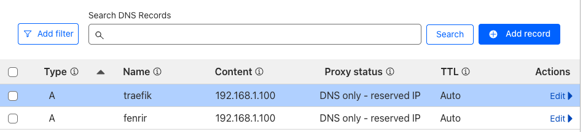

# 🔒 HTTPS for Local Domains

You can enable HTTPS using self-signed certificates for local development (`mkcert`), or automate valid public certificates with **Let's Encrypt**.

- Option 1 - [Local TLS with `mkcert` (Development Only)](#-option-1--local-tls-with-mkcert-development-only)
- Option 2 - [Automatic HTTPS with Let's Encrypt (Production/Public Domains)](#-option-2--automatic-https-with-lets-encrypt-productionpublic-domains)

---

### ✅ Option 1 — Local TLS with `mkcert` (Development Only)

Use this if you're accessing services like `https://app.like.home` in your local network and want HTTPS without browser warnings.

---

#### 👤 On Your Local Machine (Client)

Install and trust the local certificate authority (CA) so your browser accepts self-signed certificates.

**macOS:**

```bash
brew install mkcert
brew install nss # optional (for Firefox)
mkcert -install
```

**Ubuntu:**

```bash
sudo apt install libnss3-tools
curl -JLO "https://dl.filippo.io/mkcert/latest?for=linux/amd64"
chmod +x mkcert-v*-linux-amd64
sudo mv mkcert-v*-linux-amd64 /usr/local/bin/mkcert
mkcert -install
```

1. Generate certificates for your local domain:

   ```bash
   mkcert like "*.like"
   mv like+1.pem cert.pem
   mv like+1-key.pem key.pem
   ```

---

#### 🖥️ On Your Server (Traefik Host)

1. Generate certificates for your local domain:

   ```bash
   mkcert like "*.like"
   mv _wildcard.like.pem cert.pem
   mv _wildcard.like-key.pem key.pem
   ```

2. Move them to a shared volume (e.g. `/mnt/ssd/data/certs`):

   ```bash
   mkdir -p /mnt/ssd/data/certs
   mv cert.pem key.pem /mnt/ssd/data/certs/
   ```

3. In your `docker-compose.yml`, mount the certs expose port `443` and configure Traefik:

   ```yaml
   services:
     traefik:
       image: traefik:v2.11
       container_name: traefik
       command:
         - --entrypoints.web.address=:80
         - --providers.docker=true
         - --api.dashboard=true
         - --log.level=DEBUG
         - --api.insecure=true
         - --entrypoints.websecure.address=:443
        labels:
         - "traefik.tls.certificates[0].certFile=/certs/cert.pem"
         - "traefik.tls.certificates[0].keyFile=/certs/key.pem"
       ports:
         - "80:80"
         - "443:443"
         - "8080:8080" # Traefik dashboard
       volumes:
         - /var/run/docker.sock:/var/run/docker.sock
         - /mnt/ssd/data/traefik:/data
         - /mnt/ssd/data/certs:/certs
       networks:
         - traefik-net

   networks:
     traefik-net:
       external: true
   ```

4. Add TLS labels to your services:

   ```yaml
   services:
     whoami:
       image: traefik/whoami
       labels:
         - "traefik.enable=true"
         - "traefik.http.routers.whoami.rule=Host(`home.like`)"
         # - "traefik.http.routers.whoami.entrypoints=web"
         - "traefik.http.routers.whoami.entrypoints=websecure"
         - "traefik.http.routers.whoami.tls=true"
       networks:
         - traefik-net

   networks:
     traefik-net:
       external: true
   ```

5. Restart services:

   ```bash
   docker-compose down
   docker-compose up -d
   ```

6. Visit: [https://home.like](https://home.like) — no warnings should appear if your local CA is trusted.

---

### 🌍 Option 2 — Automatic HTTPS with Let's Encrypt (Production/Public Domains)

If you're using a public domain and want valid HTTPS certificates, you can enable automatic certificate generation via Traefik’s built-in Let's Encrypt resolver.

In this example, I purchased the domain `lik3.net` and configured it with Cloudflare. We'll use the DNS-01 challenge method, which requires access to the DNS provider's API.

---

#### 1. Create a Cloudflare API Token for Traefik

Go to [https://dash.cloudflare.com/profile/api-tokens](https://dash.cloudflare.com/profile/api-tokens) and click **Create Token**.

- Choose the **Edit Zone DNS** template.
- In the **Zone Resources** section, specify your domain.
- Save the generated token to a `.env` file located in the same directory as your `docker-compose.yaml`.

```dotenv
CF_DNS_API_TOKEN=your_cloudflare_token
```

---

#### 2. Disable Proxying for Domains Used by Traefik

In the Cloudflare dashboard, go to **DNS → Records** for your domain.

- Create a new **A** or **CNAME** record.
- Set the **Proxy status** to **DNS only**.
- For internal apps, you can use a placeholder IP such as `192.168.1.100`. The DNS-01 challenge does not require a valid public IP address.

> Example:
> `traefik.lik3.net → 192.168.1.100` with Proxy disabled.



---

#### 3. Configure Traefik with Let's Encrypt DNS-01 (Cloudflare)

Below is a sample configuration in your `docker-compose.yaml` for Traefik using Cloudflare DNS:

```yaml
services:
  traefik:
    image: traefik:v2.11
    container_name: traefik
    command:
      - --entrypoints.web.address=:80
      - --entrypoints.websecure.address=:443
      - --providers.docker=true
      - --providers.docker.exposedbydefault=false
      - --api.dashboard=true
      - --log.level=DEBUG
      - --certificatesresolvers.cloudflare.acme.dnschallenge=true
      - --certificatesresolvers.cloudflare.acme.dnschallenge.provider=cloudflare
      - --certificatesresolvers.cloudflare.acme.email=your@email.com
      - --certificatesresolvers.cloudflare.acme.storage=/data/acme.json
    env_file:
      - .env
    ports:
      - "80:80"
      - "443:443"
      - "8080:8080" # Dashboard access
    volumes:
      - /var/run/docker.sock:/var/run/docker.sock
      - /mnt/ssd/data/traefik:/data
    labels:
      - "traefik.enable=true"
      - "traefik.http.routers.traefik.rule=Host(`traefik.lik3.net`)"
      - "traefik.http.services.traefik.loadbalancer.server.port=8080"
      - "traefik.http.routers.traefik.entrypoints=websecure"
      - "traefik.http.routers.traefik.tls.certresolver=cloudflare"
      - "traefik.http.routers.traefik.service=api@internal"
    networks:
      - traefik-net

networks:
  traefik-net:
    external: true
```

---

#### 4. Prepare the `acme.json` File

This file will store your certificates. Create and secure it with the following:

```bash
sudo touch <path to acme.json>
sudo chmod 600 <path to acme.json>
```

> ⚠️ in this case `<path to acme.json>` is `/mnt/ssd/data/traefik/acme.json`

---

#### 5. Add Labels to Your Application Containers

Here’s an example of how to expose a service with HTTPS:

```yaml
services:
  whoami:
    image: traefik/whoami
    labels:
      - "traefik.enable=true"
      - "traefik.http.routers.whoami.rule=Host(`home.lik3.net`)"
      - "traefik.http.routers.whoami.entrypoints=websecure"
      - "traefik.http.routers.whoami.tls=true"
      - "traefik.http.routers.whoami.tls.certresolver=cloudflare"
    networks:
      - traefik-net

networks:
  traefik-net:
    external: true
```
